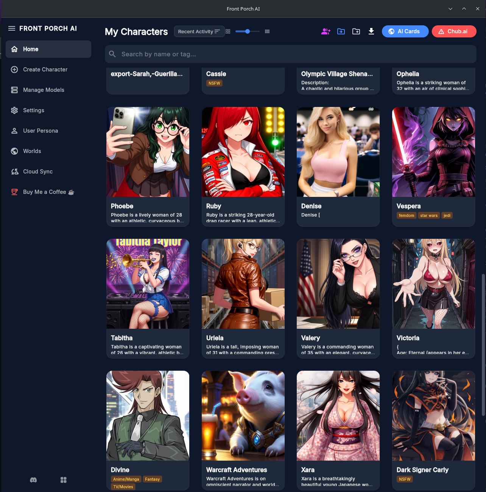
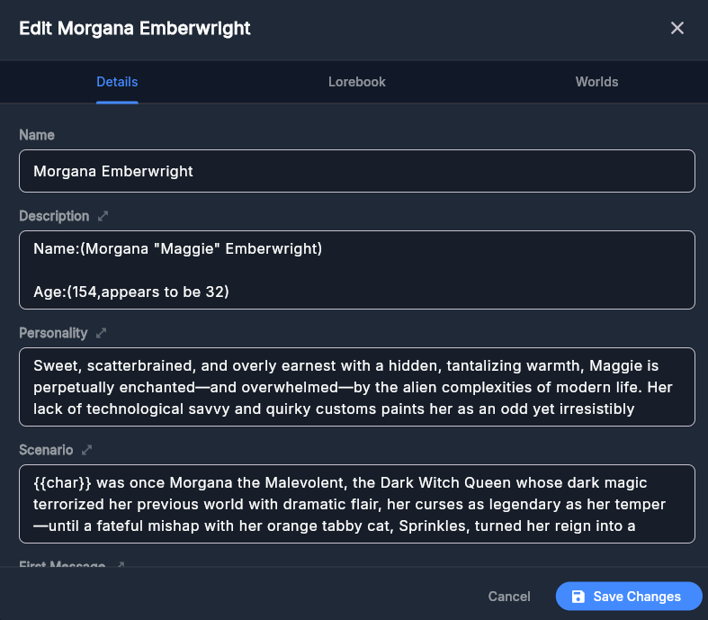
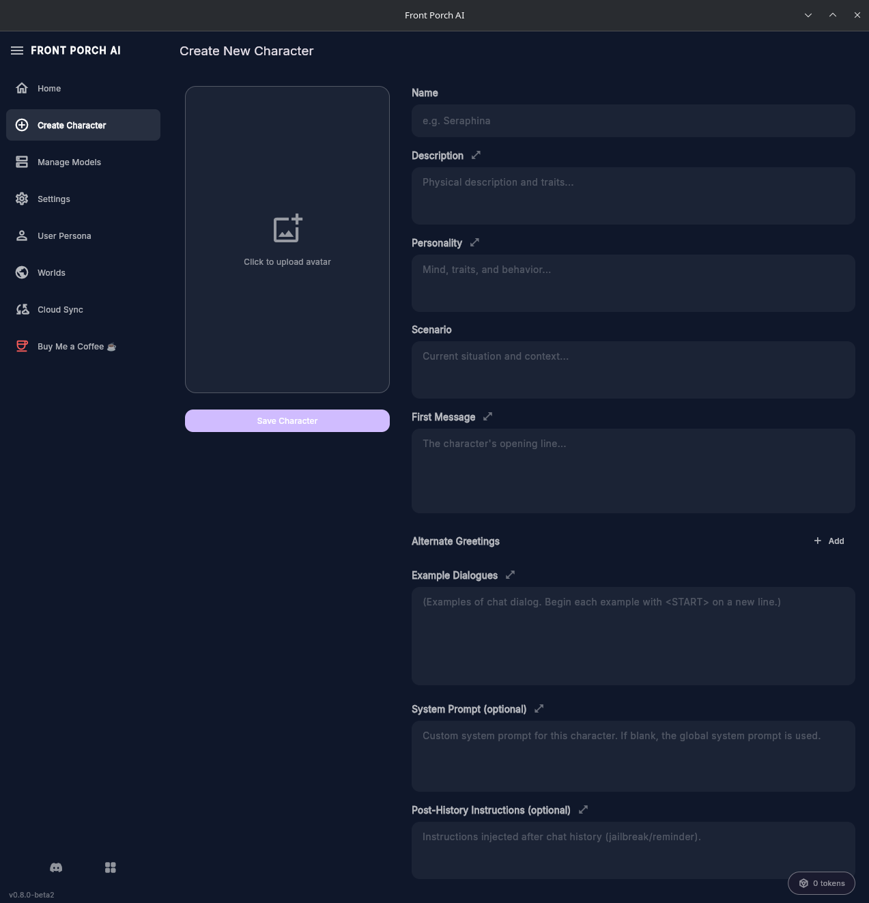
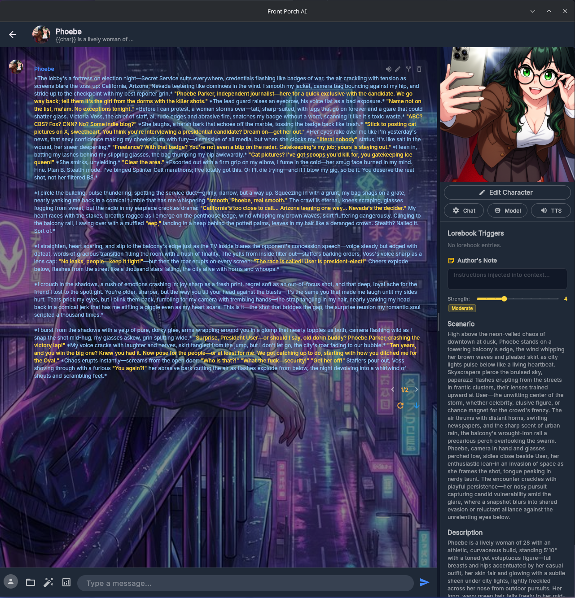
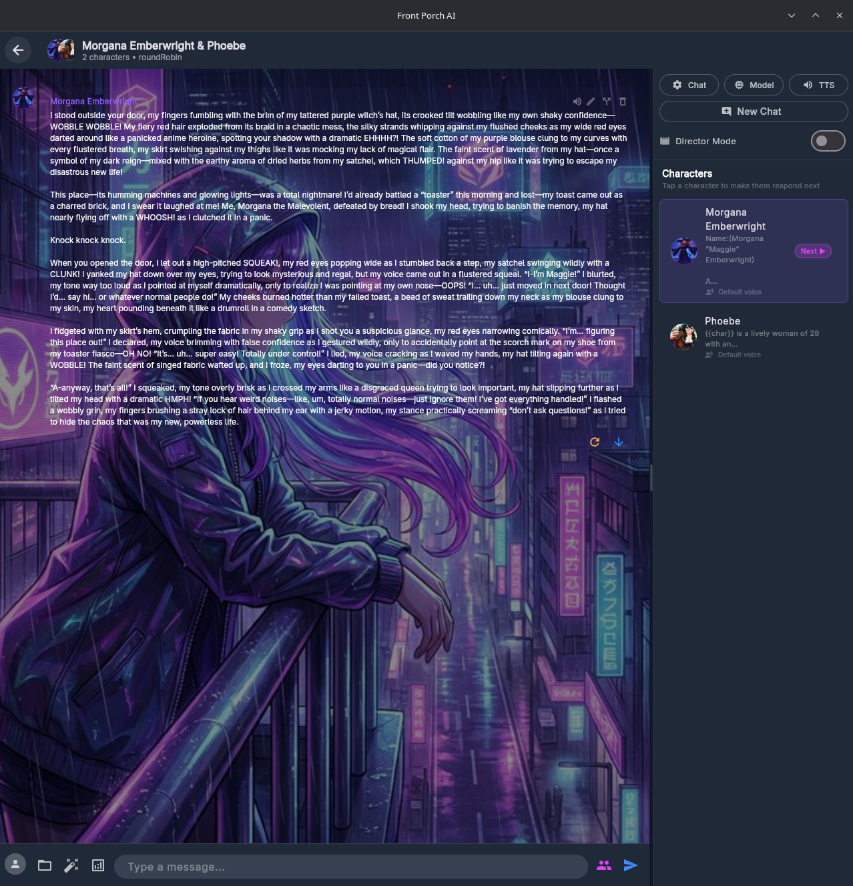
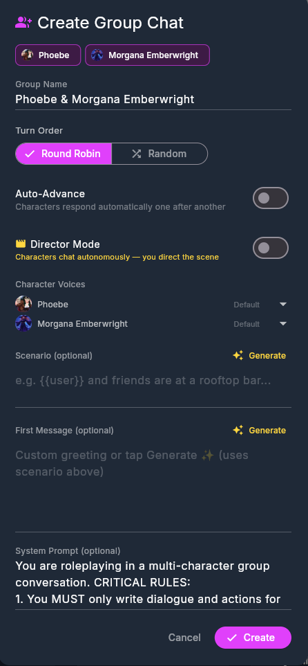
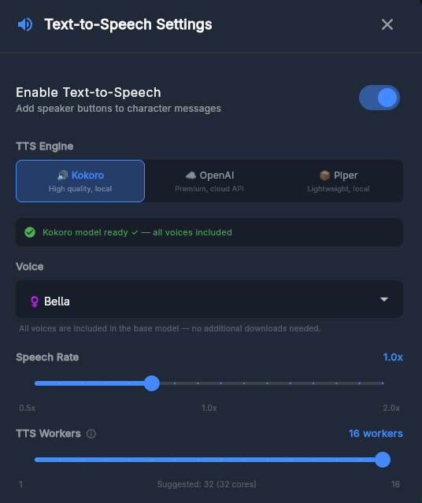
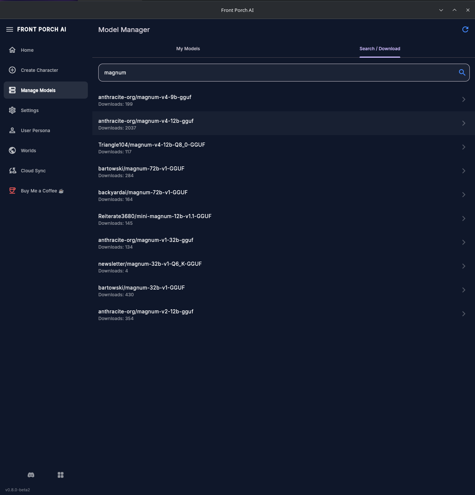
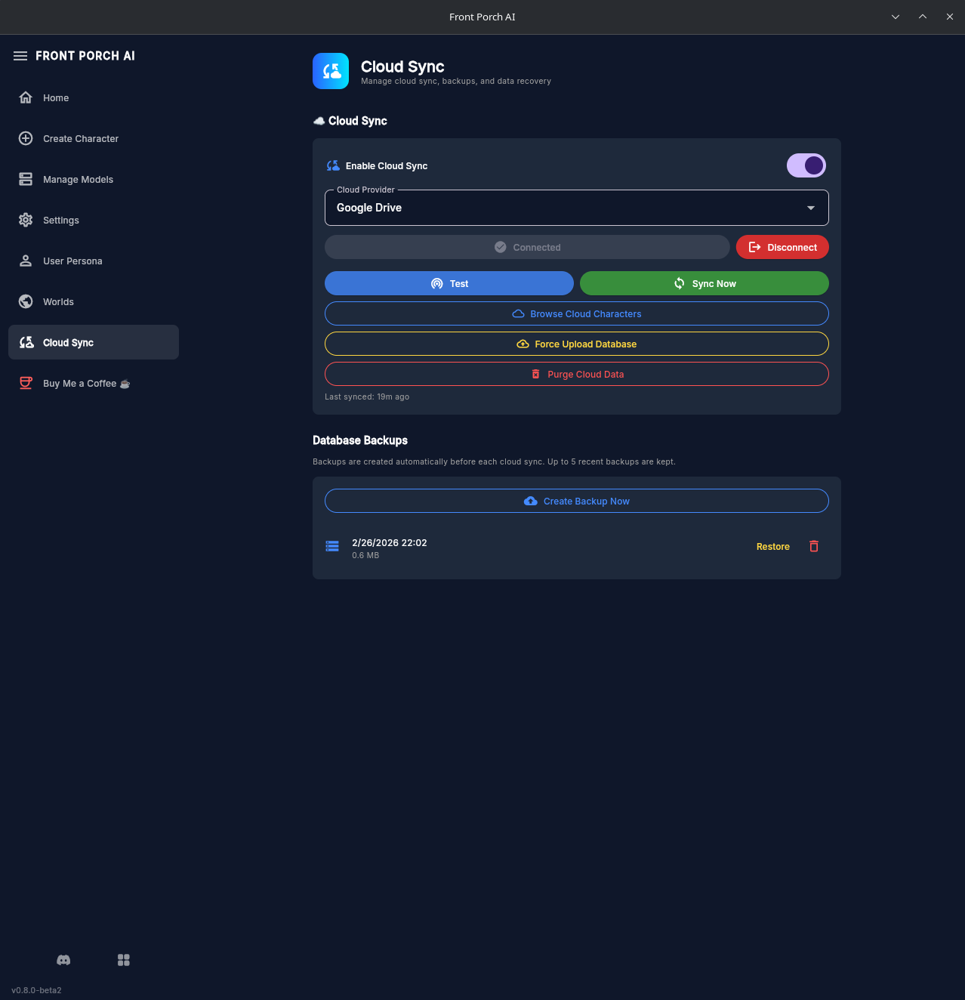

# Front Porch AI


## 📝 Note from the Dev

To the growing community of users who have shown up with kind words, encouragement, and genuine enthusiasm — you've turned what started as a passion project into something worth building every day. Your bug reports, feature ideas, and willingness to test rough edges have made Front Porch AI better in ways no single developer could. Thank you for believing in what this project can become.

— **SosukeAizen** on Discord

## 💬 Join the Community

Have questions, feedback, or just want to hang out? Connect with us:

- **Discord**: [Join our server](https://discord.gg/e4tET6rpdv)
- **Matrix**: [matrix.dreamersai.art](https://matrix.dreamersai.art)

## 🔓 Why Open Source?

Proprietary software lives and dies at the discretion of its creators. When a company moves on, shuts down, or simply loses interest, the tools you depend on become frozen in time — no updates, no fixes, no future.

Front Porch AI is proudly licensed under the **GPL v3** because we believe your tools should belong to the community that uses them. If this project is ever abandoned, anyone can fork it, improve it, and keep it alive. Open source isn't just a license — it's a promise that the software will always have a future.


## 🆕 What's New in V0.8.1

- 🐛 **Bug Fixes**:
  - Fixed custom installation directory breaking the 0.8.0 database — the DB, character PNGs, and all data files now correctly follow the user-configured install path
  - Changing install directory in Settings now properly relocates all data (database, characters, chats, worlds, models) to the new location and cleans up the old directory
  - Fixed data migration from 0.7.2 JSON format failing when a custom install directory was set — character and folder migrations now respect the custom path
  - Legacy JSON files from pre-0.8.0 (chat sessions, group chats, worlds, folder config) are now automatically cleaned up after migration

<details>
<summary><strong>📦 Previous Releases</strong></summary>

### What's New in V0.8.0

- 🔄 **Row-Level Merge Engine**: Cloud sync now performs intelligent per-row merging instead of whole-database replacement. Conflicts are resolved using `updatedAt` timestamps, preserving the most recent changes from either device.
- 🆔 **UUID Primary Keys**: All tables (Characters, Folders, Messages, Sessions, Worlds) now use UUID primary keys instead of auto-increment integers. This eliminates ID collisions when merging data from multiple devices.
- 💾 **Backup Management**: Full backup system with manual and automatic backups before each cloud sync. Restore any backup with one click, or delete individual backups you no longer need. Up to 5 recent backups are kept automatically.
- ☁️ **Dedicated Cloud Sync Page**: Cloud sync settings have been moved from the Settings page to their own dedicated sidebar page for easier access. Includes sync controls, provider configuration, cloud character browser, and backup management.
- 🔼 **Force Upload Database**: New disaster recovery option to overwrite the cloud database with your local copy — useful after restoring a backup.
- 🗑️ **Purge Cloud Data**: Nuclear option to wipe all cloud data (database + character PNGs) when recovery isn't possible. Local data is never affected.
- 🛡️ **Smarter Initial Sync**: First sync after migration now uploads local data as source of truth instead of merging, preventing duplicate entries caused by independent UUID migrations on different devices.
- 🐛 **Bug Fixes**:
  - Fixed KoboldCPP child processes not being killed on app close (Linux) — orphaned processes no longer consume GPU memory after exit
  - Fixed Google Drive cloud sync failing to upload character PNGs due to stale folder ID cache — all characters now sync reliably
  - Individual character upload failures no longer abort the entire sync batch
  - Orphaned character PNGs (from deleted characters or DB sync) are now automatically cleaned up after cloud sync
  - Re-importing a character no longer creates duplicate PNG files on disk


### What's New in V0.8.0-beta4

- 🔄 **Row-Level Merge Engine**: Cloud sync now performs intelligent per-row merging instead of whole-database replacement.
- 🆔 **UUID Primary Keys**: All tables now use UUID primary keys to eliminate ID collisions.
- 💾 **Backup Management**: Full backup system with manual and automatic backups before each cloud sync.
- ☁️ **Dedicated Cloud Sync Page**: Cloud sync settings moved to a dedicated sidebar page.
- 🔼 **Force Upload Database**: Disaster recovery option to overwrite cloud database with local copy.
- 🗑️ **Purge Cloud Data**: Nuclear option to wipe all cloud data when recovery isn't possible.
- 🛡️ **Smarter Initial Sync**: First sync after migration uploads local data as source of truth.

### What's New in V0.8.0-beta3

- 📦 **Backyard AI (.byaf) Importer**: Import characters directly from Backyard AI archive files. Full preview dialog shows persona, lore items, first message, and avatar before import. Optionally import chat history. Automatically converts `{user}` / `{character}` placeholders to V2 spec `{{user}}` / `{{char}}`.
- 📡 **Model Loading Status Bar**: Real-time status bar at the bottom of the home screen shows what KoboldCPP is doing while loading a model (loading, mapping to memory, warming up). A snackbar notification appears when the model is ready to chat.
- 🖱️ **Right-Click Context Menu**: Character card actions (edit, chat, delete, move to folder) are now accessed via a right-click context menu for a cleaner card layout.
- ☁️ **Cloud Sync Reliability**: Rewrote the database sync strategy (close → download → reopen) for better cross-platform reliability. Fixed data loss during path rebasing and improved empty-DB download priority.
- ⏱️ **Buffer Duration Setting**: New slider in Chat Settings to control how many seconds of tokens to buffer before the display starts draining (1–10s). Higher values give smoother output; lower values reduce the initial delay.
- 🛑 **Smarter Stop Sequences**: Added `</END>`, `[END]`, and `<|end|>` as essential stop sequences. Existing users receive them automatically via migration — no manual setup needed.
- 🐛 **Bug Fixes**:
  - Fixed stop generation not always halting the backend
  - Fixed model picker in chat view not updating correctly
  - Fixed session upsert causing duplicate entries
  - Fixed cross-platform character loading after cloud sync
  - Character creation now properly imports into the SQL database
  - Fixed `{{user}}` resolving to "User" instead of the active persona name in the sidebar

### What's New in V0.8.0-beta2

- 🗄️ **SQLite Database Backend**: All data storage has been migrated from scattered JSON files to a fast, reliable SQLite database powered by **Drift ORM**. Characters, chat sessions, messages, groups, folders, personas, and worlds — all in one `front_porch.db` file.
- 📊 **Migration Progress Dialog**: First-time launch after the update shows a polished full-screen overlay with step names, progress bar, and step counter while your existing JSON data is imported into the database.
- ☁️ **Simplified Cloud Sync**: Cloud sync now uploads/downloads a single `.db` file instead of hundreds of individual JSON files. Faster, more reliable, and no more out-of-sync data.
- 🧹 **Cleaner Codebase**: Removed ~200 lines of orphan cleanup, per-file JSON sync, and dual-write code. The database is now the single source of truth.


### What's New in V0.8.0-beta

- ☁️ **Cloud Sync (Alpha)**: Sync your characters, chat sessions, folder layouts, and user personas across devices. An alpha-stage warning now appears when enabling the feature.
  - **Google Drive** — OAuth 2.0 with your personal Google account.
  - **Nextcloud / WebDAV** — Connect to any self-hosted or third-party WebDAV server.
  - **Browse Cloud Characters** — Browse all characters stored in the cloud, see which ones are already on your device, and selectively download new ones with avatar previews.
  - **Bi-Directional Sync** — Characters, folders, and user personas sync both ways automatically. Newer files always win.
  - **User Persona Sync** — Your custom personas (names, descriptions, avatars) are now included in cloud sync for seamless multi-device continuity.
- 🎬 **Director Mode**: A complete overhaul of Group Chat turn management. Take control of multi-character conversations:
  - Manually choose which character speaks next.
  - Guide the flow of group conversations instead of relying solely on automated turn orders.
- 👥 **Group Chat Improvements**: Overhauled group chat experience with better stability, improved turn handling, and responsive card layouts that adapt to all UI scale sizes.
- 🎛️ **XTC Sampler**: New Exclude Top Choices sampler for more creative, less predictable text generation. Two new controls:
  - **XTC Threshold** (0–0.5) — Removes the most obvious word choices to encourage creativity.
  - **XTC Probability** (0–1.0) — How often XTC activates per generation step.
- 💡 **Setting Tooltips**: Every generation setting slider (Temperature, Min-P, Repeat Penalty, XTC, Context Size, and more) now has an ℹ️ tooltip explaining what it does in plain language — perfect for newcomers.
- 🎨 **Responsive UI**: Group chat cards now scale gracefully at all grid sizes — no more overflow at small card sizes.
- 🔒 **Privacy Policy**: PRIVACY.md documenting data handling — no telemetry, no analytics, cloud sync is opt-in and connects only to accounts you own.
- 🏷️ **Beta Prerelease Support**: Beta versions are flagged as prereleases on GitHub so they won't trigger auto-updates for stable users.

### What's New in V0.7.1

- 🔍 **Grid Scale Slider**: Resize character cards on the home screen with a header slider (150–450px). Cards adapt responsively — compact text at medium sizes, image-only with name overlay at tiny sizes.
- 💬 **Message Count Badges**: Each character card shows a chat bubble badge with how many messages you've sent (AI replies excluded).
- 📊 **Sort by Messages Sent**: New sort option to order characters by message count.
- 📂 **Multi-Select Folder Organization**: Dedicated folder selection mode for moving multiple characters into folders at once.
- 📥 **Bulk PNG Import**: Import an entire folder of character card PNGs in one action.
- 🐛 **Folder Rename Fix**: Fixed path separator mismatch that caused characters to disappear from folders on Windows.
- 🐛 **Cross-Chat Message Leak Fix**: Messages from one chat no longer appear in another character's session.
- 🏗️ **CI/CD Cleanup**: Removed the transitional `Front_Porch_AI_Setup_Alpha.exe` duplicate from releases.

### What's New in V0.7.0

- 🔊 **Multi-Engine Text-to-Speech**: Three TTS engines to choose from — all accessible from the new TTS button in the chat sidebar:
  - **Kokoro TTS** (local, default) — High-quality offline TTS powered by kokoro-onnx. 50+ voices across 9 languages. Models auto-download on first use.
  - **OpenAI TTS** (cloud) — Premium cloud-based TTS with 10 voices (alloy, ash, coral, echo, nova, etc.). Supports tts-1 and tts-1-hd models. Requires API key.
  - **Piper TTS** (fallback) — Lightweight local engine with downloadable voice packs.
- ⚡ **Parallel TTS Generation**: Sentences are generated concurrently for dramatically faster audio output. Configurable worker count (1–16) based on your CPU cores.
- 🔁 **TTS Audio Caching**: Replay the same message instantly without regenerating. Cache auto-invalidates on message edits, voice changes, or engine switches.
- ⏹️ **Stop Generation**: Cancel in-progress TTS generation with a stop button next to the progress spinner.
- 🎛️ **TTS Settings in Chat**: Quick-access TTS configuration button in the chat sidebar alongside Chat and Model settings.
- 🔄 **Linux AppImage Self-Update**: AppImage users are automatically notified when a new version is available. Download and install updates with a single click — the app replaces itself and relaunches seamlessly.

### What's New in V0.6.0

- 🎭 **Per-Character System Prompts**: Each character can now carry its own system prompt and post-history instructions. Priority chain: Character → Group → Global → Backend Default. Define character-specific behavior without touching global settings.
- 📝 **Author's Note / Memory**: A per-session note injected into the prompt at a configurable depth (1–20 messages back). Edit it right from the sidebar — automatically saved and restored with each session.
- 📊 **Context / Token Budget Viewer**: See exactly how your context window is being used with a color-coded stacked bar chart, per-section token counts, percentages, and expandable raw prompt text. Access it via the analytics button in the chat input area.
- 🌿 **Chat Branching**: Fork the conversation from any message to explore alternate storylines. Branch metadata is tracked and displayed in the session history dialog.
- 🖥️ **Windows Installer Now Stable**: The Windows `.exe` installer has graduated from alpha — fully tested and production-ready.

### What's New in V0.5.0

- 👥 **Group Chat (Pre-Alpha)**: Create multi-character group chats! Select 2+ characters and watch them interact with each other and with you in a shared conversation. Features round-robin and free-form turn orders, auto-advance mode, and full persistence.
- ✨ **AI-Generated Scenarios & First Messages**: One-tap ✨ Generate buttons in the group creation dialog.
- 🎛️ **Generation Presets**: Quick-access preset chips (Creative, Balanced, Precise, Deterministic) in Generation Settings.
- 🎨 **Improved Chat Colorization**: Fixed multi-line `*action*` block detection.
- 🧠 **Thinking Model Support**: Automatic `<think>` block stripping for thinking models.

### What's New in V0.0.4.2

- 🖥️ **Windows Installer**: Proper `.exe` installer with GPL V3 license acceptance, Start Menu shortcuts, and optional desktop shortcut
- 🍎 **macOS DMG**: Native disk image with drag-to-Applications layout and custom app icon
- 🔄 **Windows Self-Update (Alpha)**: Installer-only feature — checks GitHub Releases for new versions on startup, downloads and installs silently with user consent
- 🏷️ **Persona Titles**: Add a distinct title to personas for easier identification in lists
- 🔁 **Automatic Version Sync**: Version numbers auto-sync from Git branch/tag names via a post-checkout hook
- 🎨 **Custom App Icons**: Replaced default Flutter icons with Front Porch AI branding

### What's New in V0.0.4

- 🚀 **External API Support — Chat with Cloud Models!** Front Porch AI now supports **OpenRouter** and **Nano-GPT** as full backend providers! Seamlessly switch between your local KoboldCPP instance and powerful cloud models like Claude, GPT-4, Gemini, DeepSeek, and more.
- **Swipe Navigation**: Cycle through regenerated message variations with left/right arrows
- **Collapsible Thought Chip**: Model thinking is automatically hidden behind a collapsible "Thought 💡" chip
- **Continue Generation**: Down-arrow button on the last AI message to prompt the model to keep going
- **Chat Import/Export**: Import and export chats in SillyTavern-compatible JSON format
- **Linux Browser Fallback**: Graceful fallback to external browser on Linux
- **User Persona Enhancements**: Improved persona dialog and avatar support

</details>


## 🙏 Thank You

Front Porch AI stands on the shoulders of incredible open-source projects. This app wouldn't be possible without them:

| Project | What It Does | Link |
|---|---|---|
| **KoboldCpp** | The local LLM backend that powers all text generation. A single-file, high-performance inference engine supporting GGUF models with GPU acceleration. | [GitHub](https://github.com/LostRuins/koboldcpp) |
| **Kokoro** | Our default text-to-speech engine. Beautiful, natural-sounding voices that run entirely offline using ONNX. | [GitHub](https://github.com/hexgrad/kokoro) |
| **Piper** | Fallback TTS engine. Fast, lightweight, and privacy-respecting local speech synthesis. | [GitHub](https://github.com/rhasspy/piper) |

If you find Front Porch AI useful, please consider starring these projects too — they're the foundation everything is built on.

> **🎩 Hat tip to [Backyard AI](https://github.com/ahoylabs/byaf)** for open-sourcing the `.byaf` archive format — the one part of their stack they didn't take with them when they killed the desktop app. Your characters deserve to live somewhere they can run offline.

## 🌟 Contributors

A huge thank you to the people who have helped shape Front Porch AI through their testing, feedback, and ideas:

| Contributor | Role |
|---|---|
| **Hakko504** | Bug Testing, UI/Feature Suggestions |
| **PacmanIncarnate** | Bug Testing, UI/Feature Suggestions |
| **SunTzucious** | Beta Testing |


<p align="center">
  
</p>
<p align="center">
  <em>Organize your collection with virtual folders and comprehensive search</em>
</p>

A powerful, cross-platform desktop application designed to streamline the management of AI character cards and provide a seamless chat experience with **KoboldCPP**. Organize your collection, edit metadata, build worlds, and chat with your favorite characters in a modern, intuitive interface.

## ✨ Features

### 📇 Character Management


- **V2 Spec Support**: Fully compatible with the V2 character card specification (PNG & JSON).
- **Import & Export**: Easily import cards from other frontends or export your creations to share.
- **Metadata Editor**: Edit names, descriptions, personalities, scenarios, and first messages with a clean UI.
- **Lorebooks**: Create and attach extensive lorebooks to characters for deep world-building.
- **Organization**: Create virtual folders, tag characters, and use global search to manage large collections.
- **Tag Editor**: Manage tags directly from the Edit Character screen.
- **Web-to-Chat Import**: Direct integration with `aicharactercards.com` and `chub.ai` via an internal browser that intercepts downloads for instant auto-import.
- **V2 Smart Parsing**: Advanced V2 tEXt metadata extraction from PNG character cards.

### 🎨 Character Creation


Create detailed character cards (V2 spec compatible) with a user-friendly form UI. Support for:
- Name, Description, Personality, Scenario, First Message
- Alternate Greetings
- Tags
- Avatar image upload

### 💬 Immersive Chat Experience


- **Smooth Output Buffer**: An intelligent buffering system that delivers text at a consistent, readable pace — no matter how fast or slow your hardware generates tokens.
  - **Adaptive TPS Measurement**: Continuously monitors generation speed using a rolling 3-second window and calculates the optimal buffer size to start displaying as early as possible without interruptions.
  - **Configurable Display Speed**: Set your preferred reading speed (default: ~250 WPM / 6 tokens/sec) via a slider from 5–60 t/s. Tokens are dripped onto the screen at your pace, not your GPU's pace.
  - **No-Buffer Mode**: Prefer raw streaming? Toggle the buffer off for instant token-by-token display as they arrive.
  - **Auto-Pause & Rebuild**: If generation speed drops mid-response, the buffer automatically pauses display and rebuilds to maintain a seamless flow.
  - **Real-Time TPS Counter**: The generation bar shows live tokens-per-second, buffering status, and progress percentage.
- **Rich Text Styling**: 
  - **Dialogue** is highlighted in amber for easy reading.
  - *Actions* and narrative text are subtly styled in grey.
- **Advanced Controls**:
  - **Regenerate**: Don't like a response? Roll again.
  - **Continue**: Let the AI keep talking from where it left off.
  - **Impersonate**: Have the AI write a message *as you* (the user).
  - **Stop Generation**: Immediately halt AI generation mid-stream with one click.
  - **Message Editing**: Edit any message (User or AI) in-place to polish the narrative or fix typos.
- **Persistent Sessions**: Your chat history is automatically saved and restored when you switch characters.
- **System Prompt Library**: Save and switch between multiple system prompts. Includes a specialized "Immersive Roleplay" default.
- **User Personas**: Define your own persona name and description to influence how characters interact with you.

### 👥 Group Chat & Director Mode


- **Multi-Character Conversations**: Create group chats with 2+ characters and watch them interact with each other and with you.
- **Director Mode**: Take control of who speaks next — tap any character to direct the conversation flow.
- **Turn Orders**: Choose between Round Robin and Random turn orders, or go fully manual with Director Mode.
- **AI-Generated Scenarios**: One-tap ✨ Generate buttons for scenarios and first messages.



### 🔊 Text-to-Speech


- **Three TTS Engines**: Kokoro (local, high quality), OpenAI (cloud, premium), and Piper (lightweight fallback).
- **50+ Voices**: Kokoro ships with 50+ voices across 9 languages — all running offline.
- **Parallel Generation**: Sentences are generated concurrently for dramatically faster audio output.
- **Per-Character Voices**: Assign unique voices to each character in group chats.

### ⚙️ KoboldCPP Integration


- **Automated Management**: The app can automatically download and update the KoboldCPP backend for you.
- **Hardware Detection**: Automatically detects GPU and VRAM. Prefers **Vulkan** on PC and **Metal** on Apple Silicon. Now supports **Intel ARC** and shared memory GPUs.
- **macOS Stability**: Native quarantine management and sandbox-free execution for seamless backend launches.
- **Model Hub**: Built-in integration with HuggingFace to search for and download GGUF models directly.
- **Process Management**: Robustly handles the lifecycle of the AI backend, ensuring clean shutdowns.

### ☁️ Cloud Sync


- **Cross-Device Sync**: Sync your entire database and character PNGs via Google Drive or Nextcloud/WebDAV.
- **Single-File Sync**: All data (chats, folders, personas, groups, worlds) syncs as one database file — no more hundreds of scattered JSON files.
- **Browse Cloud Characters**: View all characters stored in the cloud, see which are already on your device, and selectively download new ones with avatar previews.
- **Backup Management**: Automatic backups before every cloud sync, with one-click restore and manual backup creation.
- **Upload-Only Characters**: Character PNGs upload automatically; downloads are user-initiated to keep you in control.
- **Privacy-First**: Syncs only to accounts you own. No data ever passes through our servers.

### 🌍 World Building
- **World Info**: Create shared lore that can be referenced by multiple characters.
- **Dynamic Context**: World info is injected into the context based on keywords, ensuring the AI knows about your world without overloading the context window.

## 🚀 Getting Started

### 📦 For Regular Users
If you just want to use the app, simply head over to the **[Releases](https://github.com/linux4life1/front-porch-ai/releases)** page and download for your platform:

- **Stable releases**: `.exe` installer (Windows), `.dmg` (macOS), `.AppImage` / `.deb` / `.rpm` (Linux)
- **Beta releases**: Standalone `.zip` (Windows/macOS), `.AppImage` / `.tar.gz` (Linux) — no installer required, just extract and run

No setup required!

---

### 🛠️ For Developers & Tinkerers
If you want to modify the code or build from source, follow these steps:

#### Prerequisites
- **Flutter Environment**: You must have the [Flutter SDK](https://docs.flutter.dev/get-started/install) installed and configured on your system.
- **Git**: To clone the repository.
- **OS**: Windows, Linux, or macOS.

#### 🐧 Linux Dependencies

If you are on Linux, you'll need a few extra packages to compile the desktop embedding:

**Ubuntu/Debian**:
```bash
sudo apt-get update
sudo apt-get install clang cmake ninja-build pkg-config libgtk-3-dev liblzma-dev libstdc++-12-dev libwpewebkit-1.0-dev
```

**Arch Linux**:
```bash
sudo pacman -S clang cmake ninja pkgconf gtk3 xz wpewebkit
```

**Fedora**:
```bash
sudo dnf install clang cmake ninja-build pkgconf-pkg-config gtk3-devel xz-devel libstdc++-devel wpewebkit-devel
```

> **Note:** `wpewebkit` is required for the built-in browser that allows you to download character cards directly from Chub.ai and AI Character Cards. If you're building from source, you must install this dependency. Pre-built AppImages bundle this library automatically.

#### Installation
1.  **Clone the Repository**:
    ```bash
    git clone https://github.com/linux4life1/front-porch-ai.git
    cd front-porch-ai
    ```

2.  **Install Dependencies**:
    ```bash
    flutter pub get
    ```

3.  **Run the App**:
    ```bash
    flutter run
    ```

### Building for Release
To create a standalone executable:
```bash
flutter build windows
```
The output will be in `build/windows/runner/Release/`.

## 🛠️ Configuration

1.  **Backend Setup**:
    - Navigate to **Settings**.
    - Click **Download Backend** to fetch the latest KoboldCPP.
    - Alternatively, manually select your `koboldcpp.exe` file.

2.  **Model Setup**:
    - Go to **Manage Models** -> **HuggingFace Search**.
    - Search for a model (e.g., "Mistral v0.3", "Llama 3").
    - Download the desired quantization (Recommended: `Q4_K_M` or `Q5_K_M`).

3.  **Optimization**:
    - In **Settings**, click **Auto-Configure** to let the app determine the best GPU layer split and thread count for your system.

## 🤝 Contributing

Contributions are welcome! Please feel free to submit a Pull Request.

1.  Fork the Project
2.  Create your Feature Branch (`git checkout -b feature/AmazingFeature`)
3.  Commit your Changes (`git commit -m 'Add some AmazingFeature'`)
4.  Push to the Branch (`git push origin feature/AmazingFeature`)
5.  Open a Pull Request

## 🔒 Privacy

Front Porch AI does not collect, store, or transmit any personal data. See our full [Privacy Policy](https://app.dreamersai.art/privacy.html).

## 📄 License

This project is licensed under the **GPLv3 License** - see the [LICENSE](LICENSE) file for details.

---
*Built with 💙 using [Flutter](https://flutter.dev).*
